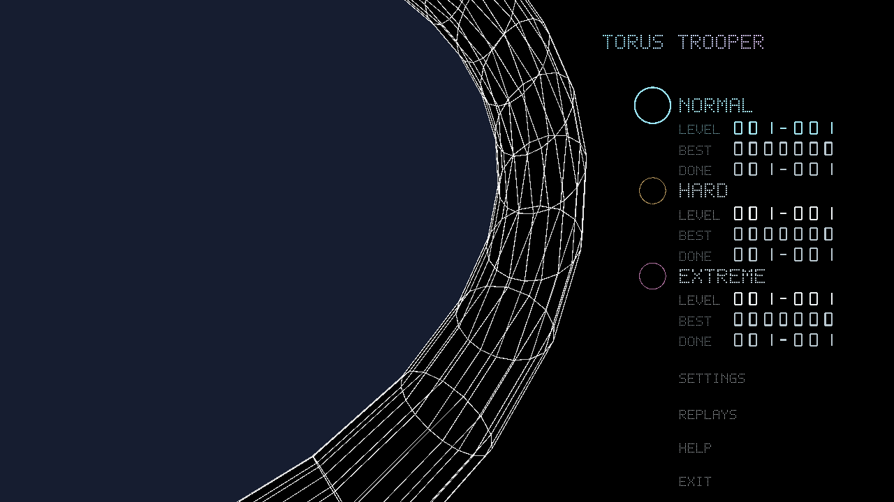
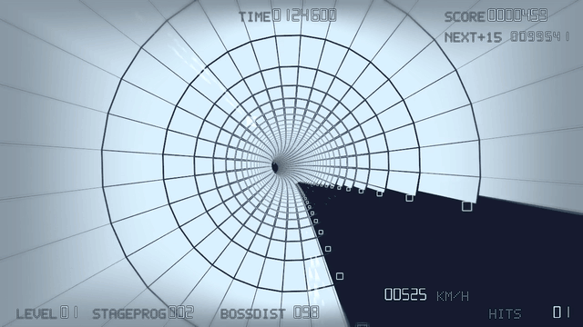

# Torus Trooper

Race through a twisting tunnel, dodge enemy fire and blast your way toward a
higher score. Torus Trooper is a free arcade shooter inspired by Kenta Cho’s
original game, with its own spacecraft, courses and presentation.

Choose **Normal**, **Hard** or **Extreme**, unlock later starting levels, and
save your runs and watch them again in the replay library.

## Get the game

Download Torus Trooper for **Windows or Linux** from the
[Releases page](https://github.com/antono2/torus_trooper/releases).
macOS is not supported.

Once you have a package:

1. Extract the entire archive into a folder.
2. On Windows, launch `torus_trooper.exe`. On Linux, run `./play.sh` from a terminal.
3. Choose **Normal** with the arrow keys and press **Space** to start.

Keep the extracted files together. You need a graphics driver with Vulkan support;
the Linux package includes GLFW and the Vulkan loader. Use `play.sh` to load the
bundled libraries. The Linux download requires glibc 2.38 or newer, as provided
by Ubuntu 24.04 and newer distributions.
If you want to compile the game yourself, see the [build instructions](docs/technical-reference.md#desktop-build-requirements).

## Gameplay preview

Normal difficulty, level 5, default visual settings.

## How to play

You start with two minutes. Dodge bullets and destroy enemies to earn points;
score milestones and clearing zones add time, while taking a hit costs 15 seconds.
The run ends when your time runs out.

Move left and right around the tunnel to stay on the track and line up your shots.
Move forward or backward to adjust your position. Hold the fire button for regular
shots. For a stronger attack, hold the charge button for at least about half a
second, then release it. Charged shots pierce enemies, clear bullets and build
score multipliers with successive kills.

Start on **Normal** to learn the controls. Use **Help** on the title screen for
an explanation of the score, timer and other displays.

## Controls

| Action | Keyboard |
| --- | --- |
| Move around the tunnel | **Left / Right** or **A / D** |
| Move forward / backward | **Up / Down** or **W / S** |
| Fire / start a run | **Space** or **Z** |
| Charge shot | Hold **Left Shift** or **X**, then release |
| Pause / resume | **P** |
| Return to title after game over | **Enter** or **R** |
| Open menu / return to your run | **Escape** |
| Toggle fullscreen | **F11** |
| Show / hide FPS | **F** |
| Raise / lower volume | **+ / −** |

On the title screen, **Up / Down** chooses an item and **Left / Right** changes
its starting level or setting. Your high scores, unlocked levels and settings
are saved automatically.

Gamepads and joysticks are also supported. On a standard gamepad, use the left
stick or D-pad to move, **A** to fire and hold **B** to charge. Press **Start**
to open the menu. **B** goes back one menu level; at the start menu,
**B**, **Start** or keyboard **Escape** resumes a suspended run. Choose
**EXIT** to quit while a run is suspended. With no suspended run, **Escape**
exits from the start menu and **Start** activates the selected menu item.
B still charges during gameplay. All controls can
be [customized](docs/technical-reference.md#advanced-settings-and-controls).

## Make it comfortable

Open **Settings** on the title screen. Use **Up / Down** to select a setting,
**Left / Right** to adjust it and **Escape** to return.

| Setting | What it changes |
| --- | --- |
| Volume | Music and sound loudness; adjusting it plays a short music preview. |
| Anti aliasing | Smoothness of edges. Lower it if the game runs slowly. |
| Panel / Wire / Border distance | How far ahead the solid track, grid and yellow track borders appear. |
| Shot distance | How far your shots travel. |
| FPS limit | Choose 60 FPS, your display’s refresh rate or unlocked. |
| Near blur / Near fade | How much nearby tunnel edges soften or darken. |
| Rear track blend | How the grid and panels blend near the camera. |

For better performance, try shorter draw distances, less blur or lower anti
aliasing. Track borders have their own distance setting, so you can keep them
visible while hiding the panels and grid.

## Watch and share replays

Choose **REPLAYS** on the title screen. Runs are saved when they finish, when
you replace a suspended run with a new one or when you quit with a suspended
run. Opening the menu suspends the active run so you can resume it.
Your previous saved replay is kept too.

- **Up / Down:** choose a recording by its date, score, difficulty and duration.
- **S** or **Left / Right:** sort by newest recording or highest score.
- **Enter:** play the selected recording.
- **R:** give it a custom name.
- **E:** export a `.ttr` replay file.
- **I:** browse for and import a replay file. Press **P** in the file browser to
  type or paste a path.
- **Delete:** remove a recording, then confirm. **Escape:** go back.

When editing a name or file path, **Ctrl+A** selects all and **Ctrl+V** pastes.
Exports won't overwrite an existing file. Imported scores do not change your
personal best.

Recordings open in the original player view with the gameplay HUD shown.
During playback, **Left / Right** switches between cinematic and player
views; **Up / Down** shows or hides the HUD. **Escape** returns to the library.
The charge button on a difficulty selection still opens the latest replay.

## More information

[Build instructions and advanced options](docs/technical-reference.md) ·
[Design guide](docs/learning-path.md) · [Changelog](CHANGELOG.md)

The game code is available under the [MIT License](LICENSE).
Bundled music and sounds retain [Kenta Cho’s license](sounds/LICENSE.txt),
and the audio library retains [its own license](thirdparty/miniaudio/LICENSE).
The Linux archive includes runtime-library license notices under
`thirdparty/linux-runtime/`.

## Source navigation

Start at [`torus_trooper.v`](torus_trooper.v) for command-line dispatch,
[`runtime/`](runtime/) for window, audio, input and Vulkan resource lifetimes,
and [`sim/`](sim/) for deterministic gameplay and replay state. The
[`shaders/`](shaders/) consume the render snapshots produced by the simulation.
File introductions identify the boundary each implementation or test exercises.

The bundled [`thirdparty/`](thirdparty/) sources retain their upstream headers;
maintain integration comments in the local bridges instead. When moving code or
adding introductions, update guide line links and run
`python3 scripts/check_guide_links.py` to catch stale source references.
