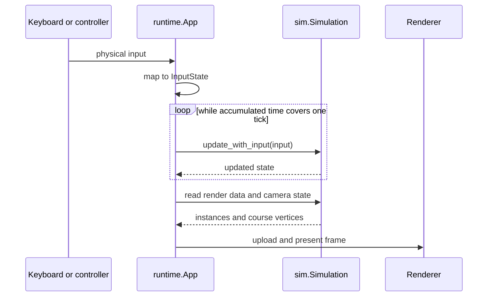

# 1. Put input, simulation, and presentation on clear boundaries

The first architectural decision is where a physical input becomes a game
action, where game time advances, and which code may produce side effects.
Torus Trooper puts those responsibilities in a runtime, simulation, and
presentation path. This chapter traces one frame before comparing other
arrangements.

## The boundary first

[`main`](../../torus_trooper.v#L7) parses launch options and chooses
between [`run_headless`](../../torus_trooper.v#L624) and
[`runtime.new_app`](../../runtime/app.v#L307). In graphical
mode, `App.run` owns the window loop. In headless mode, `run_headless` constructs
the same [`sim.Simulation`](../../sim/simulation.v#L257), calls `update` a requested
number of times, then prints checksums. These are two hosts for one game model.

The loop uses a real-time accumulator in
[`App.run`](../../runtime/app.v#L1169); it consumes one `1 / ticks_per_second` interval
for each simulation update. The constant is 60 in
[`ticks_per_second`](../../sim/gameplay_tuning.v#L6). The runtime caps a single elapsed
interval at 0.25 seconds so a long stall cannot request an unbounded catch-up
step. Presentation then uses the leftover fraction to move the camera and
course between ticks. That fraction changes drawing, not gameplay decisions.

## Trace one action

The platform bridge reports a bit mask from GLFW input. `input_state` in
[`runtime/input.v`](../../runtime/input.v#L26) converts it to `sim.InputState`, whose
fields are `left`, `right`, `up`, `down`, `fire`, and `brake`. The name `brake`
also covers the charged-shot control. Key bindings and the reverse-button
option are runtime concerns; the simulation receives the same logical fields
regardless of physical device.

For each tick, the runtime either takes live logical input or decodes a recorded
replay byte. It records live input before calling `update_with_input`. The
simulation updates the ship, weapon, enemies, shots, bullets, particles, clock,
and shake in a defined order. It never polls GLFW.
[Chapter 2](02-deterministic-simulation.md) explains why that order matters;
[Chapter 4](04-replay-and-persistence.md) explains why recording the input is
enough to replay it when the seed and rules are also fixed.

## Draw without advancing the game

After all due ticks, `App.run` derives a presentation fraction from its
accumulator. It uses `presentation_course_position` and related helpers in
[`simulation.v`](../../sim/simulation.v#L2271) to form a presentation copy of the
ship state. It then obtains entity data from
[`render_instances_for_camera_with_scales`](../../sim/render_snapshot.v#L518)
and tunnel geometry from
[`render_course_wire_without_markers`](../../sim/course.v#L655).
[Chapter 5](05-rendering.md) follows those buffers into Vulkan.

The distinction matters when adapting this design: a high-refresh display may
draw two or three frames during one 60 Hz game tick. Drawing must not secretly
spawn enemies, consume random numbers, or change collision results. Put those
decisions in `update_with_input`; let presentation read their results.

## Why this split fits the game

The game supports headless regression, input replay, and optional OpenCL work.
A simulation that directly polls GLFW or submits Vulkan commands would make
those paths depend on the window and driver. The explicit `InputState` and
render snapshot boundaries let the same rules run in a window, a replay, or a
counted headless loop. The cost is conversion: input bits become logical
actions, and simulation state becomes render data each frame. These
conversions must be kept accurate as features change.

## Other viable loop designs

| Design | Where it fits | Cost to account for |
| --- | --- | --- |
| Fixed simulation tick with interpolated presentation, as here. | Arcade action, replay, lockstep networking, and tests that depend on update order. | An accumulator, catch-up policy, and interpolation for smooth displays. |
| Variable elapsed-time updates. | A small visual application whose state is mostly continuous and does not need exact replay. | Collision and tuning can change with frame rate; large time steps need clamping or subdivision. |
| Fixed gameplay tick plus independent animation and UI clocks. | An asset-rich game with animation, menus, and effects that need different rates. | Clear ownership rules: animation may sample gameplay state but must not alter its decisions unexpectedly. |

For example, a desktop game may be suspended for several seconds. Replaying every
missed tick on resume could freeze the screen; discarding the gap and resuming
from a saved state may be better. Torus Trooper caps one elapsed interval at
0.25 seconds, a policy that limits catch-up work but does not solve every
suspend-and-resume requirement. A networked game would also need to decide
whether to delay input, predict, or roll back state; this repository does not
implement those protocols.

In a fixed-gameplay, free-animation variation, the host can call
`simulation.update_with_input` only when its fixed accumulator reaches a
tick, but advance UI fades and decorative animation from presentation time
on every frame. The animation reads the latest gameplay snapshot and never
writes back into collision state. That gives an asset-rich game smooth
animation without making its hit rules depend on display refresh.

The choice is therefore about the game's correctness contract. If a result
must repeat from seed and input, keep gameplay in discrete updates and specify
their order. If exact repetition is unnecessary, a simpler host may be
appropriate. In either case, make the boundary between game decisions and
presentation explicit enough to test and change.
