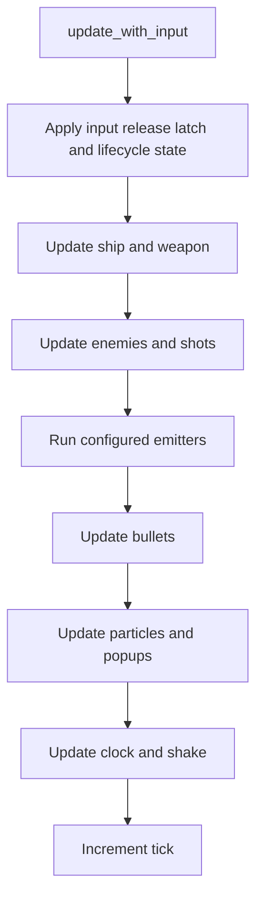

# 2. Make state, update order, and memory policy explicit

The central contract is that the same configuration and sequence of logical
inputs produce the same sequence of gameplay decisions. That contract involves
more than a random seed: update order, allocation order, and numeric operations
also affect the result. This chapter explains those dependencies and compares
entity-storage choices.

## State, time, and input

[`SimulationConfig`](../../sim/simulation.v#L233) holds the initial grade, capacities,
seed, and enabled rules. [`Simulation`](../../sim/simulation.v#L258) owns the mutable
ship, entity pools, score, clock, stage, course, and random generators. One call
to `update_with_input(InputState)` advances exactly one tick; its caller decides
when to call it. There is no wall-clock read inside that update.

The fixed step avoids a frame-rate dependency: moving an enemy once per display
frame would move it at different speeds on 60 Hz and 144 Hz monitors. The
runtime's accumulator calls the update at 60 Hz; headless mode simply calls it
in a counted loop. Both use the same function.



This is a summary of the order in `update_with_input`, not a substitute for the
function. Ordering is observable: a shot created before `update_shots` may be
processed on this tick, while a particle created afterward waits until the
particle pass. Moving a call can change collisions, scores, random draws, and
replay results even if the individual functions are unchanged.

## Randomness is explicit state

[`rng.v`](../../sim/rng.v#L10) implements MT19937.
[`new_simulation`](../../sim/simulation.v#L333) creates
separate seeded streams for stage, barrage, enemy, shot, particle, ship, and
other decisions. One subsystem can then consume an extra draw without shifting
another subsystem's sequence. The course generator also receives an explicit
seed. No simulation function should call a platform random generator or read
the current time; the runtime chooses the seed for a new live run and stores it
with the replay.

The [`test_subsystem_random_streams_start_equal_and_advance_independently`](../../sim/simulation_test.v#L73)
test demonstrates the distinction: streams begin from the same seed but advance
independently. This does not make arbitrary refactors safe. Changing draw order
*within* a subsystem can still change the run.

## Pools and ordered decisions

`SimulationConfig` sets fixed capacities for bullets, shots, enemies, and
particles. The arrays are allocated in `new_simulation`; active items occupy
slots rather than growing a new entity collection every tick. Cursor and
replacement rules are part of behavior: a full pool can reject or replace a
spawn, and later collision passes visit slots in a stable order. See
[`test_disappearing_bullet_reserves_its_pool_slot_for_45_ticks`](../../sim/simulation_test.v#L35)
for a small example of a slot staying occupied during an effect.

The fixed arrays avoid per-spawn allocation and make maximum memory use
predictable. They also make overflow behavior part of the design. In this
game, cursor and forced-replacement rules determine which slot receives a
projectile; a disappearing bullet continues to occupy its slot. These details
are observable because collisions and some effects visit slots in order.
[Chapter 7](07-compute-and-verification.md) shows how candidate work can be
parallel while final hit decisions remain ordered.

## Memory models worth considering

| Model | Good fit | Main tradeoff |
| --- | --- | --- |
| Fixed-capacity pools, used here. | Known peak populations, frequent spawn/despawn, bounded memory, stable indices. | A peak above capacity needs a deliberate drop, replacement, or expansion policy; idle slots still reserve memory. |
| Growable arrays or vectors. | Populations that vary widely, tools, or a game where overflow is unacceptable. | Growth may allocate and move elements; stable references need handles or indirection. Reserve capacity when peaks are predictable. |
| Arena or frame allocation. | Short-lived render data or events whose whole lifetime ends together. | Individual objects are not normally freed; retaining a pointer past reset is an error. |
| Sparse or archetype entity stores. | Many entity kinds and systems that benefit from querying dense component groups. | Moving entities between groups can change indices and iteration order; handles and ordering rules become important. |

These are not quality levels. A commercial bullet game may reasonably ship
with fixed projectile pools. A commercial simulation with player-created
content may require growable storage because no fixed cap is acceptable.
Some games use several models: fixed gameplay pools, an arena for per-frame
render commands, and growable arrays for menus or editor data. Choose based
on lifetime, peak size, ordering requirements, and the cost of overflow.

One alternative design would store each bullet in a growable array, remove
dead bullets by swapping in the final element, and reserve enough capacity to
avoid routine growth. That is efficient, but swap removal changes iteration
order. If hit order affects score, the game would need stable IDs and a
separate ordered collision pass. The apparently local memory decision
therefore changes gameplay semantics.

For a concrete growable variant, keep a slot number and generation in every
external handle. Increment the generation when a slot is reused, so an old
handle cannot refer to a new bullet in the same slot. Maintain a separate
ordered list of active IDs for collisions, while a dense array holds motion
data. Motion can then use compact storage without silently changing hit
priority. This adds lookup and bookkeeping work, but it permits growth and
safe references from effects or scripts. An *archetype store* groups entities
with the same components into dense arrays; moving an entity to another
group needs the same handle discipline.

## Choose a layout for the work actually done

An *array of structs* (AoS) stores complete records next to one another.
The gameplay pools here are `[]Bullet`, `[]Shot`, `[]Enemy`, and `[]Particle`:
each slot keeps the state needed to make its ordered decisions. A *structure
of arrays* (SoA) stores one field across many entities before the next
field. [`ParticleMotionSoa`](../../sim/compute_backend.v#L785) has separate arrays
for angles, depths, velocities, lives, and source pool indices. It collects
only active particles for a motion pass, then scatters the results back to
their stable gameplay slots.

```text
AoS: [angle, depth, velocity, life, visual details] [angle, depth, velocity, life, visual details] ...
SoA: angles     [a0, a1, a2, ...]
     depths     [d0, d1, d2, ...]
     velocity_x [x0, x1, x2, ...]
     velocity_y [y0, y1, y2, ...]
     lives      [l0, l1, l2, ...]
```

AoS is convenient when one decision reads many fields of one entity, as the
bullet update does when it checks movement, pattern state, disappearance,
and collision. SoA can reduce irrelevant field loads when a pass touches
one or two fields across many entities, and it can make contiguous vector
operations easier. A blocked AoS/SoA hybrid keeps small groups of entities
together when several fields are normally used as a group. None is
universally faster: SoA adds streams and this game's compaction, copy, and
scatter steps cost time. A side array such as `bullet_patterns` keeps
pattern-runner state separate from `Bullet`, but also adds a lookup when a
live bullet needs it. [Intel's layout discussion](https://www.intel.com/content/www/us/en/developer/articles/technical/memory-layout-transformations.html)
describes why the access pattern decides among these layouts.

The common operation is often called the *fast path*: it should do only the
work needed for that case. In [`update_bullets`](../../sim/simulation.v#L462),
a bullet with no active pattern skips pattern execution. A dead slot also
skips motion, but the loop still visits it and clears its pattern's active
flag. These are shorter paths through one iteration, not active-only passes
over the pool. An active-index list could avoid scanning empty slots when
occupancy is low. It would need updates on every spawn, death, and
replacement, and must preserve collision order for replay. For a bounded
512-slot default bullet pool, the extra bookkeeping may cost more than the
scan; only a representative measurement can decide. The same tradeoff
applies to splitting rare events into a slower path: keep the frequent
operation short without changing when an event occurs.

## Size the working set, not just a struct

`RenderInstance` in [`render_snapshot.v`](../../sim/render_snapshot.v#L23) is
exactly 64 bytes in the checked build. A thousand instances occupy 64,000
bytes (62.5 KiB) before accounting for the SoA arrays, course vertices,
game state, and other work. Its size says nothing by itself about whether
those records stay in L1 or L2 cache. Cache capacities and sharing vary by
CPU; alignment, access order, other active data, and competing threads matter
too. A smaller record can reduce bytes fetched per pass, but removing a field
may force a second lookup or conversion that loses the gain.

Estimate a pass's working set: records visited, the fields used, cache lines
fetched, side arrays, and temporary buffers. Then measure frame time and
cache misses on target CPUs with realistic active counts. If misses matter,
try hot/cold field separation, active-slot compaction, or processing bounded
chunks; compare the full update, including conversion and scatter costs.
[Intel's cache metrics guide](https://www.intel.com/content/www/us/en/docs/vtune-profiler/user-guide/2024-2/cpu-metrics-reference.html)
recommends reducing the working set or blocking when misses are measured;
[Arm describes variable cache configurations](https://developer.arm.com/community/arm-community-blogs/b/architectures-and-processors-blog/posts/innovation-on-arm-cortex-processors).

## What the checks establish

`Simulation.checksum` folds selected gameplay fields and exact `f32` bit
patterns into a 64-bit value. The headless command prints it after the
requested ticks; [`scripts/check.sh`](../../scripts/check.sh) compares a
600-tick run with a fixed baseline. Focused tests establish narrower
contracts, including the generator's reference sequence, independent random
streams, and pool behavior. A checksum detects drift but does not explain it.

An input-log replay in the same controlled build can use this strict
contract. Replays shared across operating systems, compiler versions, or
future game updates need a stronger policy: version the rules and save format,
constrain floating-point behavior or use fixed-point arithmetic where
necessary, and decide what happens when an old replay is no longer
compatible. Deterministic networking needs similar work plus an input and
state-correction protocol. This repository's checksum alone supplies none
of those guarantees.
