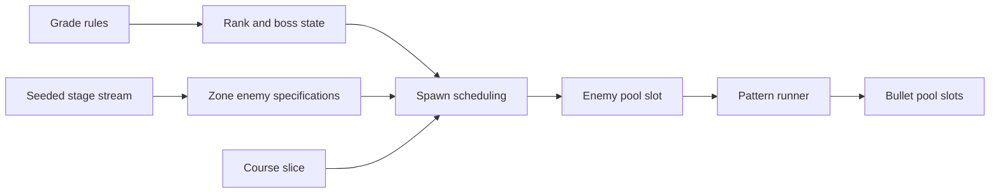
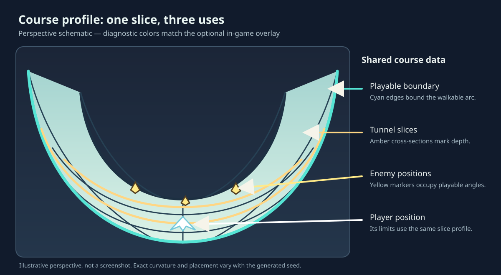

# 3. Represent rules and content without hiding behavior

The simulation does not need a different update loop for each difficulty,
course, or barrage. It keeps common update rules and supplies data that varies
by grade, zone, and seed. The question for another game is how much content
should be generated, authored, or interpreted at runtime.

## Separate constants from transitions

[`rules_for_grade`](../../sim/rules.v#L23) maps Normal, Hard, and Extreme to
ship and stage constants. [`StageProgression`](../../sim/stage.v#L6) is a small
state machine for rank, boss arrival, and zone completion. Keeping these
apart lets tests ask
whether a grade has the correct constants and whether the transition rules work
for any grade.

[`update_stage_spawning`](../../sim/simulation.v#L1056) decreases spawn distances by
ship speed, selects the next enemy kind, and installs an enemy in a fixed pool.
It uses the stage random stream and the current
[`CourseProfile`](../../sim/course.v#L31) to place that enemy on a playable slice.
An occupied pool can reject the spawn; the random draws already made still
count. That detail matters to a replay because later choices must consume the
same random sequence.

The course itself is generated once from a seed in
[`generate_course`](../../sim/course.v#L160). Its slices hold width, radius, and
turning information. [`slice_at`](../../sim/course.v#L287) wraps positions around
the course; [`course_side`](../../sim/course.v#L298)
checks whether an angle lies on the playable track. The same profile informs
movement constraints and drawn tunnel geometry. Reusing one course definition
prevents the collision boundary from drifting away from the visible track.

The perspective sketch distinguishes the playable edges (cyan), sampled
tunnel slices (amber), and enemies placed at valid course angles (yellow).
The same data drives all three; only the drawing is illustrative. To inspect
these relationships in a live run, launch with
`--debug-view=boundaries,slices,enemies`. A full-width tunnel has no open
boundary to highlight, so the cyan edges appear on narrower sections.

## Express barrages as programs

The game defines its barrage content as native V programs in
[`pattern_catalog.v`](../../sim/pattern_catalog.v#L33). A
[`PatternProgram`](../../sim/pattern.v#L129) is a list
of `PatternInstruction` values. Operations include fire, wait, repeat, action
call, direction and speed changes, and end.
[`ValueExpression`](../../sim/pattern.v#L27) evaluates a
postfix sequence whose inputs can include literals, rank, parameters, and the
pattern's seeded random stream. A *postfix expression* puts an operation after
its operands: `1 rank 5.2 multiply add` represents `1 + rank × 5.2`.

[`PatternRunner`](../../sim/pattern.v#L181) keeps the instruction position, wait
counter, call frames, repeat frames, direction, and speed between ticks. Its
[`tick`](../../sim/pattern.v#L332) method emits `PatternShot` values. The
simulation then allocates actual
bullets in its pool. This separates the description of a barrage from the
entity lifecycle and collision rules.

The simplest worked case is
[`straight_pattern`](../../sim/pattern_catalog.v#L53): one fire instruction
followed by end. The
[`test_native_straight_pattern_fires_relative_to_its_owner`](../../sim/pattern_test.v#L27)
test establishes the resulting direction and speed.
[`nway_pattern`](../../sim/pattern_catalog.v#L67) uses rank
to calculate a repeat count, fires sequenced directions, and waits 50 ticks.
At rank `0.5`, its
[focused test](../../sim/pattern_test.v#L73) expects seven shots: one central shot and
three on each side. The example shows that the interpreter's expression,
repeat, and wait semantics can be checked without a graphical test.

## Choose a content workflow

| Approach | Why choose it | What the team must maintain |
| --- | --- | --- |
| Native V pattern constructors, used here. | A fixed catalog, source-controlled review, deterministic tests, and no runtime parser. | Designers need a code change and build to adjust content. |
| Authored data such as JSON or XML. | Designers can edit many patterns independently of engine code. | A schema, validation, migration, useful errors, and a way to preview content. |
| Offline compilation to compact runtime programs. | Authored content can be validated and transformed before shipping while the game executes a small interpreter. | A content compiler, source-to-output traceability, versioning, and build integration. |
| Runtime scripts. | Highly variable behavior or modding with rapid iteration. | Sandboxing, instruction and memory budgets, API stability, determinism rules, and error recovery. |

For a dense arcade game with a finite repertoire, native constructors and a
bounded runner can be enough for a shipped product. For a studio with
designers authoring hundreds of encounters, an editor and offline validation
may save more time than the simpler runtime saves. A mod-capable game may
accept a script runtime's complexity because user-created content is a core
feature. A pattern runner still needs limits: an instruction loop with no
wait or end must not freeze the frame.

An offline-compiled variation could let designers author a pattern in a
visual editor, validate that every repeat and action call has a valid target,
bound the number of instructions executed per tick, and emit a compact
versioned program. The game would load only that program and run an
interpreter much like `PatternRunner`. The editor and compiler would retain
a mapping to the source pattern so a runtime error identifies the authored
action. That pipeline costs tooling work, but makes large catalogs safer to
edit and review.

Course generation has the same decision shape. The seeded
[`generate_course`](../../sim/course.v#L160) creates replayable variation from a
small rule set. An authored level can support deliberate pacing, landmarks,
and bespoke encounters. A hybrid can generate a base track and place authored
set pieces into validated slots. An asset-rich 3D game might choose authored
geometry while retaining procedural enemy waves. The shared design principle
is to keep the gameplay-facing representation explicit so collision, rendering,
and replay agree about the same level.
