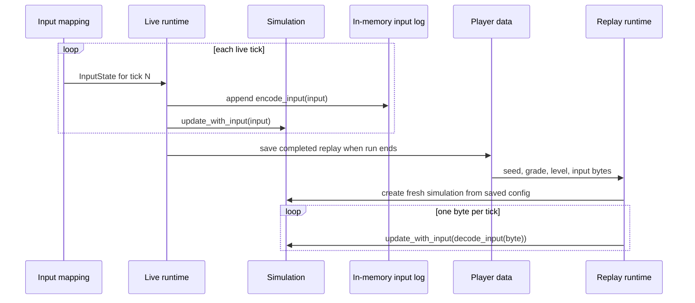

# 4. Choose what a replay and save file promise

Replay is a consequence of the deterministic boundary from
[Chapter 2](02-deterministic-simulation.md).
Torus Trooper stores the initial seed, grade, starting level, and one logical
input byte per tick, plus shot range and god mode, rather than every ship and bullet position. A fresh
simulation consumes those inputs in order. This is compact, but the design
implicitly promises that the relevant rules and numeric behavior remain
compatible.

## Encode game actions, not devices

[`Replay`](../../sim/replay.v#L3) contains `grade`, `starting_level`,
`random_seed`, `inputs`, `player_shot_distance`, and `god_mode`. [`encode_input`](../../sim/replay.v#L13) assigns bits
to the six fields of `InputState`; [`decode_input`](../../sim/replay.v#L36)
reverses that mapping. A keyboard, controller, or
rebound key therefore produces the same replay byte when it means the same
game action. The format records a tick's actions, not when a key event arrived
within a display frame.

In [`App.run`](../../runtime/app.v#L1206), the live path appends the encoded input to
`recorded_inputs` before calling `update_with_input`. It copies the completed
log into player data when the run ends. The replay path indexes the stored byte by
`simulation.tick`. At the end of recorded input it enters the game-over tail;
the title's attract replay later restarts from the same seed. The
[`replay_test.v`](../../sim/replay_test.v#L8) test creates a 420-tick input sequence,
records its bytes, replays them into a fresh simulation, and compares gameplay
checksums.

## Keep camera and sound outside the replay contract

The replay camera in [`replay_camera.v`](../../sim/replay_camera.v#L27) uses its own
seeded state to choose cinematic views. The title can also show a ship-follow
view. These choices change presentation, not the recorded gameplay inputs.
Attract replay runs silently because [`App.run`](../../runtime/app.v#L1224) decides
when audio should play. Neither camera controls nor audio-device state need to
be written into each tick's input byte.

## Persist only valid data

[`PlayerData`](../../runtime/player_data.v#L24) stores settings, records, and
a replay library as JSON, with a legacy latest-replay field for migration and
title playback. Each recording adds a name, timestamp, and score. `load_player_data` falls back to defaults when the
file cannot be read or decoded; `normalize` clamps settings, ensures array
sizes, migrates older values, and rejects invalid library entries. The
version field supports changes in the save format. `record_result` copies the
replay and updates scores when a run ends. Opening the menu suspends the live
simulation and input log; resuming restores them without advancing the timer.
Starting a replacement run or quitting commits the suspended recording once.
Portable `.ttr` files have a separate format version and
validate bounded tick inputs before importing. Import never changes high scores
or unlocked levels. The library sorts indices rather than changing storage
order, so renaming or sorting keeps a recording attached to its input log.

That boundary is useful beyond games: treat a file as untrusted input even
when your own program wrote it. Decode, normalize, then use it. Keep the
serialized representation separate from the live simulation types so save
format changes need not alter the tick loop.

## Replay designs for different promises

| Recording model | Strength | Cost and risk |
| --- | --- | --- |
| Initial state plus input log, used here. | Small files; gameplay can be replayed with the same model. | Seeking requires replay from the start; rule or numeric changes can invalidate old recordings. |
| Periodic full state snapshots. | Fast seeking and recovery from a long replay. | Larger files and a versioned serializer for every relevant state field. |
| Input log with occasional snapshots. | Compact ordinary playback with bounded seek time and checkpoints. | The input and snapshot formats must agree; more complex validation. |
| Recorded positions and events for presentation. | Playback can survive many rule changes and may be portable across devices. | Larger recordings; cannot usefully re-simulate changed decisions or interact with the run. |

Consider a ten-minute arcade run. If replay is only an attract screen, the
small input log may be sufficient. If a player must scrub to a particular
moment or create a video, periodic checkpoints avoid replaying from tick
zero. If replays are shared after game updates, the team must either retain
old rules, migrate recordings, use presentation data, or state a limited
compatibility window. The current `PlayerData` version controls save
normalization; it does not preserve old simulation rules.

A concrete hybrid format could store a header with a rules version, seed,
starting options, and input encoding version, followed by input bytes and a
checkpoint every few seconds. A checkpoint must contain the tick, active
entity slots, pool cursors, stage state, and random-generator states, not
only visible positions. Playback can start at the nearest checkpoint and
consume later inputs. The added serializer must be versioned and validated;
otherwise fast seeking creates a new source of replay divergence.

## Save data is a separate promise

Settings, high scores, and the replay library share one JSON container here,
but they have different lifetimes. A renderer setting can be clamped or
reset safely; a high score may need stronger integrity expectations; a replay
depends on exact starting conditions. An asset-rich game with large worlds
may use separate settings, profile, and checkpoint files, with transactional
writes or backups so a failed write does not destroy a whole save. A
cloud-synced game also needs a conflict policy. Those features are outside
this repository's simple local save model.

The
[`test_replayed_inputs_reproduce_simulation_checksum`](../../sim/replay_test.v#L8)
test checks reconstruction from a fresh simulation. The
[`player_data_test.v`](../../runtime/player_data_test.v#L212) tests check
normalization and invalid data. They are evidence for two different
contracts: replay behavior and file ingestion.
