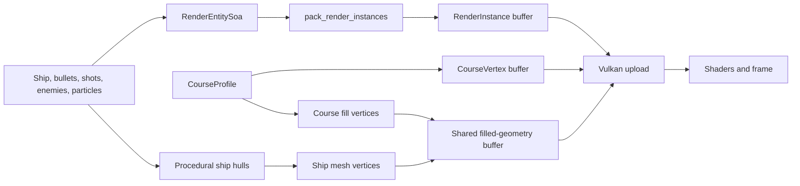
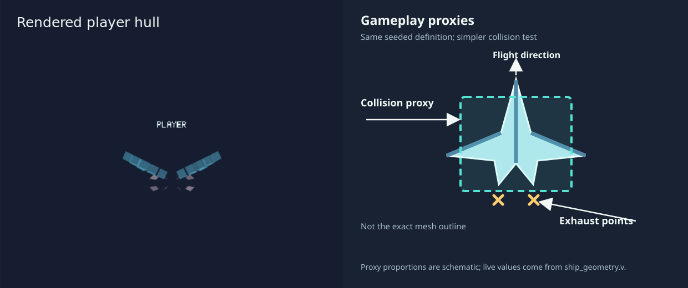

# 5. Design the render boundary and choose an asset pipeline

A renderer needs positions, orientations, materials, and geometry. The
simulation needs collision and progression state. Torus Trooper converts
between them explicitly, which keeps the game model headless and permits
presentation at a different rate. Another game must also decide where its
visual assets come from and how they reach GPU memory.

## Use a snapshot boundary

[`render_snapshot.v`](../../sim/render_snapshot.v#L22) defines `RenderInstance`, a
64-byte value of sixteen `f32` fields. It carries tunnel position, visual kind,
scale, a local orientation frame, and rotation. A `RenderEntitySoa` first
collects each field in a separate contiguous array. *Structure of arrays*
(SoA) means that all angles are adjacent, all depths are adjacent, and so on.
`pack_render_instances` then forms the per-object `RenderInstance` values used
by the current Vulkan staging path. The same scene therefore has an explicit
compute-facing layout and an explicit renderer-facing layout.

The course is drawn through separate vertex types in
[`course.v`](../../sim/course.v#L349): wire geometry and filled panels. Ship hulls
also have a separate procedural mesh path in
[`ship_mesh.v`](../../sim/ship_mesh.v#L719). Seeded ship structure definitions in
[`ship_geometry.v`](../../sim/ship_geometry.v#L25) are also used for collision
dimensions and exhaust placement. That relationship keeps a generated
silhouette and its gameplay footprint in agreement.

The left panel is a capture of the current player hull in TUNE; the right
panel illustrates its simpler collision footprint and exhaust attachments.
The proxy is deliberately not the rendered outline. Both are derived from the
seeded ship definition, so an imported replacement would need equivalent
collision and attachment data. In play, `--debug-view=collisions,exhaust`
shows these proxies over the scene without changing the simulation.
[`App.run`](../../runtime/app.v#L1289) chooses the visible view and passes the
resulting arrays to `tt_platform_set_bullets`, `tt_platform_set_tunnel`,
`tt_platform_set_tunnel_fill`, and `tt_platform_set_ship_mesh`. `set_bullets` accepts the general instance stream, including shots and effects.
The C bridge uploads those arrays and the [`shaders/`](../../shaders) directory
contains their rendering programs.

## Interpolate presentation, not decisions

The fixed-tick model records changes in ship position and angle. Between two
ticks, `App.run` computes a fraction from the unconsumed accumulator time and
uses `presentation_course_position`, `presentation_eye_angle`, and related
helpers in [`simulation.v`](../../sim/simulation.v#L2261). It changes a presentation
copy of the ship before extracting geometry. Collisions, spawning, scoring,
and replay input indexing still use the discrete simulation state.

The course position can wrap around a lap. The interpolation helpers use a
wrapped difference so a crossing at the end of the course takes the short
route instead of visually moving backward across the whole track. This is a
specific example of why presentation interpolation needs domain knowledge.

[`replay_camera.v`](../../sim/replay_camera.v#L27) supplies a seeded cinematic
view for recorded runs, while ordinary play and ship-follow replay use the
ship-centered path selected in `App.run`. The runtime passes camera
parameters to the Vulkan bridge; shaders then transform tunnel and entity
geometry, while the HUD uses its own presentation path. Another game might
keep all camera logic in a renderer or attach cameras to authored scene
objects. The important boundary is that switching cameras must not change
collisions or the replay's logical inputs.

The [shader directory](../../shaders) includes source and compiled SPIR-V
files. A production shader pipeline must ensure its compiled files match the
reviewed source and target device features; editing only the source does not
change what the current binary loads.

## Decide how geometry reaches the GPU

[`vulkan_memory.v`](../../runtime/vulkan_memory.v#L52) allocates three
host-visible, host-coherent vertex buffers that remain mapped. C renderer code
writes frame data into separate regions for frames in flight. This removes a
map/unmap cycle and simplifies the bridge. The tradeoff is that the required
memory class may be less efficient for GPU reads than device-local memory,
and the buffers reserve space for their maximum intended streams.
Host-coherent memory means CPU writes do not require a separate cache flush
for visibility, though frame synchronization still prevents reuse while
the GPU reads the region.

| Upload design | Useful when | Important cost |
| --- | --- | --- |
| Persistently mapped upload buffers, used here. | Dynamic vertex data changes each frame and simplicity or CPU write latency matters. | Host-visible memory requirements, capacity planning, synchronization, and possibly slower GPU reads. |
| Staging buffer copied into device-local buffers. | Large or repeatedly read geometry, especially static meshes. | A copy command, transfer scheduling, and more resource lifetime management. |
| GPU-generated geometry or indirect draws. | Very large populations or expensive CPU geometry generation. | Device-side algorithms, debugging, and synchronization; simulation consistency must be designed explicitly. |

An asset-rich game can mix these paths. Static environment meshes may live
in device-local memory after one upload, while particles use a mapped stream
every frame. A renderer that handles thousands of distinct materials may
also need batching, texture atlases, or descriptor management beyond this
project's compact visual-kind stream. The correct split depends on profiling
the actual target GPUs and scenes, not on a rule that all buffers should use
one memory type.

## Choose where visual assets come from

Torus Trooper's tunnel, shots, effects, and ship hulls are generated from code
and seeds. That fits an abstract arcade style and allows scalable variation
without distributing a large model library. It is an artistic and engineering
choice, not a general requirement for games in V.

Hull materials are generated in [the ship fragment shader](../../shaders/ship.frag).
Triangle coordinates keep broad bands and panel trim attached to the hull as it
moves. The run seed, level and zone select the pattern, so recorded playback reproduces
it and palette transitions cannot animate it accidentally. Cyan player trim and
orange enemy trim keep their roles recognizable. Dark seams and bright accents
provide contrast with both pale course panels and an unfilled tunnel; markings
simplify as projected faces become small. No texture images are loaded or uploaded.

[Projectile shading](../../shaders/bullet.frag) pairs a dark edge with a bright
core. Screen-space derivatives filter the procedural boundaries for ordinary
and charged player shots and hostile projectiles, including at 1x MSAA.
Solid hulls write depth and use opacity blending; solid instances use a second
projectile pipeline. Adjacent blend groups preserve the stream order, while
particles and multiplier overlays retain additive blending.
These materials affect presentation only: geometry, collision sizes, RNG state,
and replay inputs retain their existing definitions.

The tuning scene also accepts optional shape definitions from
[`tune_models.json`](../../models/tune_models.json), validated by
[`ship_model_catalog.v`](../../sim/ship_model_catalog.v#L54). When enabled, a
definition replaces one preview hull in the tuning scene; ordinary play
still uses its compiled procedural hull. This is a useful example of
data-driven visual iteration, but it is not an importer for purchased 3D
models, materials, rigs, or animations.

| Asset source | Strength | Work still required before release |
| --- | --- | --- |
| Procedural models and effects. | Consistent parametric variation, small source assets, and direct links to gameplay dimensions. | Art direction, silhouette review, animation or deformation if needed, performance limits, and artist-friendly controls. |
| Purchased professional models. | Faster access to detailed authored work when it matches the game's style. | Check license and provenance, reconcile scale and orientation, materials, rigging, texture budgets, and visual consistency. |
| Commissioned models. | Assets designed for the game's exact style, camera, and animation needs. | Briefs, review cycles, budget, delivery formats, rights, and integration testing. |
| Hybrid pipeline. | Generated terrain or effects alongside authored characters and landmarks. | Shared scale, lighting, collision, level-of-detail, and import conventions. |

For a distant, fast-moving projectile, a generated low-poly form may read
better and cost less than an elaborate purchased mesh. A close camera on a
story character may justify professional modeling, rigging, animation, and
materials. Buying a model does not remove integration work: its topology,
texture resolution, draw calls, collision proxy, and animation set must fit
the target scene. Generated visuals can also be production quality when
their controls and outputs have been art-directed and tested.

For example, replacing the generated boss hull with a purchased model is
more than swapping its vertex buffer. The current
[`ship_shape_collision`](../../sim/ship_geometry.v#L54) and exhaust offsets
derive from a shape seed. An authored boss needs an explicit collision proxy
and named exhaust attachment points, or an importer that generates and
reviews them. The build should validate those fields, convert the model to
the game's units and axes, and prepare suitable material and level-of-detail
data. Static mesh data can then be uploaded once into device-local memory;
the per-frame stream need only send its transform and state. That is one
production-oriented alternative to regenerating the whole hull path.

[`render_snapshot_test.v`](../../sim/render_snapshot_test.v#L12) checks layout,
orientation, and representative geometry before a window opens. Headless
checksums catch data changes; a graphical review is still needed for framing,
materials, motion, and readability. The two forms of evidence cover different
failure modes.
