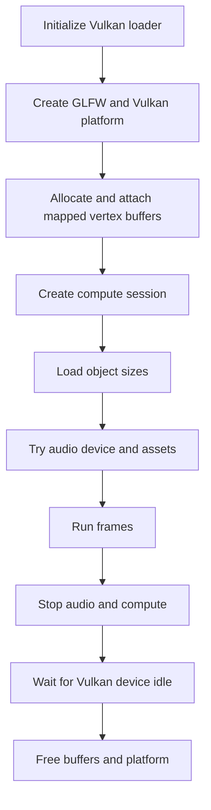

# 6. Own resources and turn state into side effects

The simulation can be replayed because it does not own a window, sound
device, or Vulkan allocation. [`runtime.App`](../../runtime/app.v#L282) owns those
resources and translates state changes into effects. This chapter explains
why ownership sits there and when other service designs would be preferable.

## Keep one owner for native resources

[`new_app`](../../runtime/app.v#L316) initializes the Vulkan loader, creates
the GLFW/Vulkan platform, sets input bindings, creates the mapped vertex
buffers, opens a compute
session, loads object sizes, and then attempts audio creation. Each failed
step releases what has already been created.
[`App.shutdown`](../../runtime/app.v#L1986) stops audio and
compute first, waits for the device to become idle before freeing Vulkan
memory, and destroys the platform last. Calling `shutdown` again is safe
because each released handle is cleared.

The order is a dependency order, not a requirement to use these exact APIs.
The renderer must not read a buffer after its allocation is released. The
audio callback must stop before its device and data are destroyed. If audio
creation fails, `new_app` logs the reason and proceeds silently; a failed
window or Vulkan setup prevents graphical startup because there is no frame
target to use.

## Understand the V–C boundary

[`runtime/app.v`](../../runtime/app.v#L42) declares `C.tt_platform_*` functions;
[`vulkan_bridge.h`](../../runtime/vulkan_bridge.h#L114) implements the platform,
swapchain, pipelines, per-frame commands, input mapping, and presentation.
[`vulkan_memory.v`](../../runtime/vulkan_memory.v#L52) owns the three mapped
vertex buffers through the V Vulkan allocator. It attaches their handles and
mapped pointers to the C platform. The ownership split is explicit: V creates
and releases the allocations; C writes frame data into them and submits draw
work. The allocator requires host-visible, host-coherent upload memory. Its
suballocations replace separate allocations for each stream, while the
renderer continues to receive stable mapped pointers.

[`shaders/`](../../shaders) holds source shaders and checked-in SPIR-V binaries.
Changing a shader source requires regenerating its binary before the running
game can display the change. The [technical reference](../technical-reference.md) covers the Vulkan
SDK and binding requirements. This boundary is a useful way to contain native
code, but it is not a general claim that V programs need a C renderer.

## Translate state changes into audio events

The simulation increments counters such as `fired_shots`, `enemy_hits`, and
`warning_beeps`; it does not call an audio API. `capture_audio_state` in
[`runtime/app.v`](../../runtime/app.v#L2060) takes values before a tick.
[`play_simulation_audio`](../../runtime/app.v#L2083) compares those values with
the values after the tick and selects sound effects or music transitions.
[`audio.v`](../../runtime/audio.v#L78)
is a small V wrapper around [`audio_bridge.h`](../../runtime/audio_bridge.h),
which uses vendored miniaudio. The wrapper supports a null backend for tests.

This counter comparison keeps effects outside the deterministic model. It
also has a deliberate limit: it reports whether a kind of event occurred
during a tick, not an arbitrarily long list of every occurrence. A game with
positional audio, several simultaneous impacts, or effect parameters would
benefit from an ordered event list. A replay could regenerate that list from
simulation; it need not store raw audio samples.

## Alternatives for ownership and effects

| Design | When it fits | Cost to manage |
| --- | --- | --- |
| One application owner and explicit shutdown, used here. | A single window and a small fixed set of devices. | A large host loop can accumulate responsibilities; partial startup needs careful unwind. |
| Subsystems with scoped resource owners. | Several windows, streamed assets, or frequent device recreation. | Dependencies and destruction order must still be explicit across owners. |
| Event queue from simulation to services. | Many sound, haptic, particle, or analytics events per tick. | Event lifetime, ordering, deduplication, and overflow need rules. |
| Direct service calls inside gameplay objects. | A very small prototype where replay and headless use are irrelevant. | Tests and ports become coupled to devices; hidden side effects complicate deterministic behavior. |

A commercial 3D game may stream models and music while a level runs. In that
case, the simple startup/shutdown lifetime here is insufficient: assets need
reference or handle ownership, cancellation, load failure behavior, and a
budget for CPU and GPU residency. A game must also handle audio interruption
and possible graphics-device loss. Those events are different from final
shutdown. The runtime would need explicit
pause, release, and restore states while keeping save data safe.

For a game with positional sound, an illustrative simulation event could
carry a tick, event kind, entity ID, and world position. The simulation
appends events in its established update order. After the tick, the runtime
consumes them for audio, haptics, or subtitles. If the event buffer has a
fixed capacity, the design must specify which events survive overflow; if
it grows, the team must budget its worst-case allocation. Neither version
requires the simulation to know which audio library plays the sound.

[`audio_test.v`](../../runtime/audio_test.v#L16) uses a null backend to test
effect calls, missing assets, forced initialization failure, and repeated
shutdown without speakers. [`scripts/check.sh`](../../scripts/check.sh)
adds a Vulkan probe for platform startup and mapped buffers. Neither check
proves audio mix quality or device recovery, which require their own review
on intended hardware.
