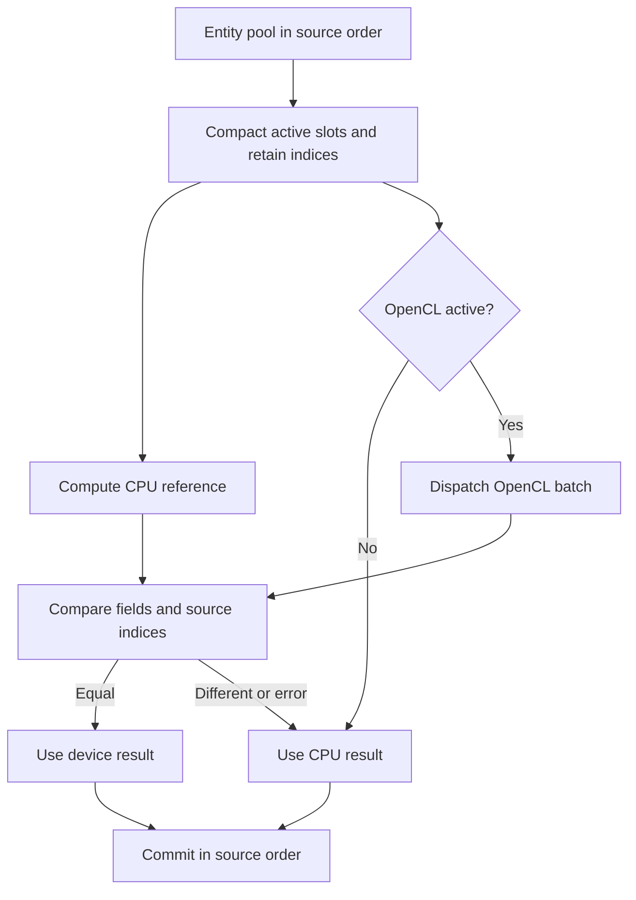

# 7. Decide whether work belongs on the CPU or GPU

The default motion backend is the CPU. An OpenCL build can move selected
motion and collision-candidate work to a device, but established gameplay
order remains on the CPU. The decision to use compute depends on workload
size, transfer cost, target hardware, and how much determinism the game
requires. This project's checked mode does not claim a speedup: it calculates
every OpenCL batch against CPU reference work.

## Choose work with a stable boundary

[`compute_backend.v`](../../sim/compute_backend.v#L784) defines separate arrays of
fields for particle, bullet, shot, and enemy motion. Each batch records
`source_indices`, so compacting active pool slots does not lose their original
order. CPU functions such as
[`cpu_step_particle_motion`](../../sim/compute_backend.v#L833) provide the reference
result. [`opencl_compute.v`](../../sim/opencl_compute.v#L418) contains the optional
device kernels and reusable buffers.

Collision candidates are pairs that *might* overlap after a broad check.
[`shot_enemy_collision_candidates`](../../sim/compute_backend.v#L63) and
[`shot_bullet_collision_candidates`](../../sim/compute_backend.v#L85) give
the CPU reference in shot-major, target-minor order. The OpenCL path compacts
active shots and targets, creates candidate pairs, and compares the resulting
stream with the CPU reference. The normal ordered collision pass still
rechecks each pair: an earlier hit may have killed a participant. Parallel
candidate generation therefore does not decide scoring or entity lifecycle.

The exact field comparison uses zero tolerance for the current correctness
mode. A numerically different device batch uses the CPU result and increments
diagnostics. This protects deterministic gameplay but spends CPU time doing
reference work; measure an intended performance mode separately before
claiming it is faster.

## Make absence and failure ordinary states

[`new_compute_session`](../../sim/compute_backend.v#L126) records both the
requested and active backend. A normal build lacks `-d opencl_compute`;
requesting OpenCL then selects the CPU and
records why. An OpenCL build can also fall back when no device is available or
when initialization or dispatch fails. The session owns its device resources
and `App.shutdown` closes it.

Headless output reports the requested and active backend, verified and
mismatched batches, fallback counts, per-workload mismatches, collision
candidate counts, and a compute checksum. Read these numbers together with
the gameplay checksum. A matching gameplay checksum alone could hide a device
path that never ran; `compute_active` and `compute_verified_batches` reveal
whether it did.

## Other compute designs

| Design | When it fits | Principal constraint |
| --- | --- | --- |
| CPU-only simulation. | Small or medium populations, strict gameplay order, broad hardware support. | CPU time rises with entity and pair counts; use data layout and broad-phase design before adding a device. |
| CPU-authoritative with optional GPU batches, used here. | Parallel motion or broad-phase work where the CPU still owns hit and score order. | Upload, download, comparison, and fallback can cost more than the saved work. |
| GPU-authoritative visual particles. | Large effects that do not affect gameplay collisions or replay state. | Visual results may vary across devices; resource and synchronization budgets still matter. |
| GPU-authoritative gameplay simulation. | Very large, parallel state when the game can define device-side ordering and compatibility. | Debugging, replay portability, and readback become major design problems. |

For a dense arcade game, the CPU path may already meet the frame budget.
Moving a few hundred objects over a device boundary can be slower than
updating them in place. A very large particle field may favor GPU generation
if particles are visual only. An asset-rich game may spend more frame time on
animation, culling, and rendering than on projectile motion; optimizing the
wrong subsystem would add complexity without improving the frame.

A concrete visual-only variation keeps gameplay particles or hit markers on
the CPU, but lets the GPU generate decorative sparks from compact spawn
events. The events carry a seed and emission parameters; the GPU owns the
decorative particles until they expire. Collisions never read them back.
That avoids per-frame download and separates visual variation from replay
decisions, at the cost of device-specific appearance and another effect
budget.

On intended hardware, measure sustained frame time and thermal behavior as
well as a short peak benchmark. A GPU workload can compete with rendering for
bandwidth and power. OpenCL availability varies across desktop systems, so
the CPU fallback remains part of the supported configuration.

## Evidence before choosing

The ordinary binary reports `compute_requested=opencl` but
`compute_active=cpu` when built without `-d opencl_compute`. The
[`compute_backend_test.v`](../../sim/compute_backend_test.v#L266) and
[`scripts/check.sh`](../../scripts/check.sh) verify that fallback preserves
gameplay checksums. The optional `TT_OPENCL_SMOKE=1` gate requires a device
run and checks its batches. Those are correctness checks, not benchmarks.

A performance comparison would need realistic entity counts, frame-time
distributions, transfer and synchronization costs, and the same visual
quality on each path. It should include the fallback path and intended
devices. Only after that evidence can a team choose whether to keep strict
comparison, relax it under a stated tolerance, or remove the device path.
