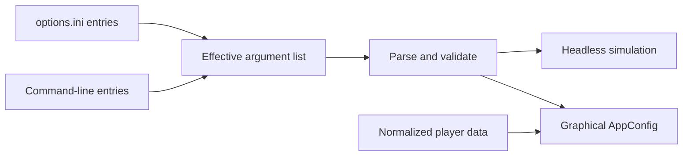

# 8. Make configuration and release evidence understandable

A game must decide which settings come from defaults, files, the command
line, or player preferences. A team also needs evidence that its chosen build
works on intended devices. This chapter explains this repository's
precedence, shows a development loop on each desktop OS, and distinguishes
regression evidence from production performance and compatibility evidence.

## Resolve configuration in a known order

[`effective_arguments`](../../torus_trooper.v#L163) reads whitespace-separated
options from `options.ini`, then appends command-line arguments. Parsers for
options that can be overridden scan the resulting list and let later entries
win. `main` validates values before constructing `AppConfig` or entering
headless mode. [`torus_trooper_test.v`](../../torus_trooper_test.v#L6) checks that
a command-line resolution, grade, level, and other settings override earlier
file values. An invalid resolution exits with status 2 before window creation.



Saved player data enters later: `new_app` uses stored settings only when a
corresponding command-line option was not explicitly supplied. This is why
`AppConfig` carries flags such as `audio_volume_explicit`. Selected grade and
level follow the same principle in `App.run`. `object_sizes.json` has its own
path and normalization in [`object_sizes.v`](../../runtime/object_sizes.v#L81).
When adopting this design, write down precedence for each setting; an ordered
argument list alone does not specify how saved preferences interact with it.
For a desktop developer build, a command line is convenient. A consumer
game may put the same values in an in-game settings panel and per-player
profile. In each case, normalize the effective value
before it reaches rendering or simulation.

## Match each check to a risk

| Check | What it demonstrates | What it cannot demonstrate |
| --- | --- | --- |
| `v -cc gcc test torus_trooper_test.v` | Option parsing and launch decisions. | A working Vulkan driver. |
| `v -cc gcc test sim runtime` | Focused rules, geometry, replay, persistence, audio lifecycle, and compute fallback. | The appearance of a presented frame. |
| Headless 600-tick command | A fixed build's gameplay, render, course, and compute checksums. | Cross-platform bit identity or visual quality. |
| `./scripts/check.sh` | Tests, build, headless baselines, fallback, and a Vulkan surface/allocation probe. | Human judgment of motion, sound, and layout. |
| `TT_VISUAL_SMOKE=1 ./scripts/check.sh` | An automated effects scene can run in a graphical environment. | A complete visual review. |
| `TT_OPENCL_SMOKE=1 ./scripts/check.sh` | An installed OpenCL device runs the checked backend. | A measured performance improvement. |

The gate in [`scripts/check.sh`](../../scripts/check.sh) also rejects legacy
SDL, VGL, and OpenGL paths. It compares fixed headless values and checks an
invalid-resolution error path. The CI workflow
[`ci.yml`](../../.github/workflows/ci.yml) builds and tests on multiple
operating systems with a tested V3 toolchain. Those
checks complement local runs; they do not replace inspecting a graphical
change on an actual display.

## A development loop on each desktop OS

A short loop starts with the smallest test that describes the changed rule,
then builds the game, runs a fixed headless case, and observes the affected
scene. For example, after editing barrage behavior,
[`sim/pattern_test.v`](../../sim/pattern_test.v#L27) is a focused check; after
changing course drawing, the graphical view and its diagnostic overlays
matter more. The 600-tick run is a regression signal, not a visual check.
Run the broader platform gate before publishing a change. The commands below
assume a checkout at the repository root and the
[build requirements](../technical-reference.md#desktop-build-requirements).

### Linux

[`build_linux_v3.sh`](../../scripts/build_linux_v3.sh) prepares its tested V3
compiler, V modules and Vulkan headers on the first run; later runs reuse them.
With a window or virtual display available:

```sh
# Prepare the compiler, modules and headers.
bash scripts/build_linux_v3.sh
tt_toolchain=${TT_V3_TOOLCHAIN_DIR:-${XDG_CACHE_HOME:-$HOME/.cache}/torus-trooper-v3/c0449e860641}
export VULKAN_SDK="$tt_toolchain/Vulkan-Headers"
export VMODULES="$tt_toolchain/modules"
export V_MACOS_V3_NO_FALLBACK=1

# After an edit: focused test, build, fixed run, visual review.
"$tt_toolchain/v/v" -cc gcc test sim/pattern_test.v
bash scripts/build_linux_v3.sh
./torus_trooper --headless --ticks 600 --no-sound --volume 0
./torus_trooper --no-sound --volume 0 --debug-view=boundaries,slices,enemies

# Before publication: the broader Linux gate.
PATH="$tt_toolchain/v:$PATH" ./scripts/check.sh
```

The graphical command opens the game for a human check. The last command
is the Linux regression gate, including a Vulkan probe; `TT_VISUAL_SMOKE=1`
adds the automated effects scene when that view changed.

### macOS audio bridge

macOS has no supported graphical game build. Contributors editing the audio
bridge can reproduce its CI check with:

```sh
cc -std=c99 -Iruntime runtime/audio_bridge_compile.c -o /tmp/tt-audio-probe \
  -framework CoreAudio -framework AudioToolbox -framework AudioUnit \
  -framework CoreFoundation -lpthread -lm
/tmp/tt-audio-probe
```

This checks the C audio bridge independently of the window and Vulkan renderer.

### Windows

Use PowerShell with the CI-compatible V3 compiler, a Windows x64 MinGW Clang
toolchain, V modules and `VULKAN_SDK` configured. The
[Windows build instructions](../technical-reference.md#windows) describe GLFW
setup. The helper's verification option runs the test files, headless regression
and Vulkan probe with the matching compiler flags:

```powershell
.\scripts\build_windows.ps1 -Verify
.\torus_trooper.exe --no-sound --volume 0 --debug-view=boundaries,slices,enemies
```

The graphical command opens the game for visual inspection. The Windows CI uses
the same build helper and probes the executable after extracting its ZIP.

If a focused test fails, inspect its named rule. If only a headless checksum
changes, compare the relevant state and counts before updating a baseline.
A graphical failure points to the host, driver, shaders, or buffer boundary.

## Improve the measured frame and the game people experience

A 60 Hz display presents a new frame about every 16.7 ms; the simulation's
fixed 60 Hz tick is a separate clock. Sustaining that display rate requires
the whole frame to fit its budget. Record the distribution of CPU simulation
time, render preparation and upload time, GPU time, and input-to-display delay
in dense scenes on target hardware.
Look at slow frames and long sessions as well as averages. A change that
saves a small amount in one loop may be irrelevant if geometry generation,
GPU fill, or synchronization dominates that frame.

| Observed problem | Current design and possible change | Cost or quality condition |
| --- | --- | --- |
| Many empty pool slots are visited. | [`update_bullets`](../../sim/simulation.v#L461) scans its fixed bullet pool; a maintained active-index list or dense active range could shorten sparse passes. | Maintain spawn and death bookkeeping, preserve ordered hit decisions, and compare complete tick times at both low and peak occupancy. |
| Collision pair checks rise with population. | [`shot_enemy_collision_candidates`](../../sim/compute_backend.v#L63) and [`shot_bullet_collision_candidates`](../../sim/compute_backend.v#L85) test active shots against target slots. Spatial bins in tunnel angle and depth could narrow candidates. | Wrap angular bins at the seam; emit pairs in the same shot and target order, or define and test a new hit order. Count tested pairs and measure the cost of building bins. |
| Rendering consumes frame time or bandwidth. | [`App.run`](../../runtime/app.v#L1192) regenerates tunnel geometry and render streams, then uploads them. Draw distance and antialiasing settings can reduce work; cached or device-local geometry is another option. | Measure CPU generation, transfer, and GPU time separately. Reduce distant detail only while hazards, path, and text remain readable. |
| Compute offload adds latency. | The optional checked OpenCL path compacts, transfers, runs, reads back, and compares against CPU reference work. | Count total batch time and synchronization, not kernel time alone; preserve a tested CPU path for unsupported or failing devices. |

Speed is one quality constraint. A late input response, uneven frame pacing,
unclear projectile silhouettes, clipped UI, or an unstable save can harm the
game even when average frames per second is high. Test those outcomes with
people and devices that match the intended audience. Keep a reproducible
scene and settings record for each performance comparison; use replay and
checksums to catch accidental rule changes when an optimization touches
update order.

## Choose evidence for the product

Passing tests and a short Vulkan probe establish useful properties, but a
sellable game needs evidence against its own requirements. If the target is
a desktop arcade game, measure worst-case projectile scenes, input latency,
frame pacing, and long-session stability on representative GPUs. If the
target is an asset-rich game, include streaming stalls, memory growth,
texture quality, and content import errors.

Collect frame-time distributions rather than only average frames per
second, and record scene, device, build, and settings with each result.
Use separate correctness, visual, usability, and performance reviews:
one green test suite cannot answer all four questions. Treat a changed
baseline as a change to explain, not an expected value to update by reflex.
