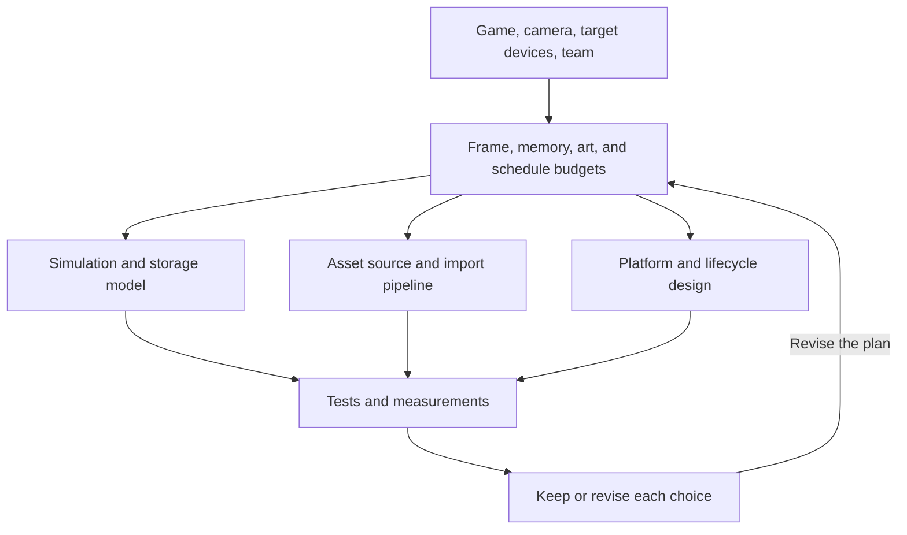

# 9. Fit the architecture to a product and its devices

Torus Trooper demonstrates a working game, not a universal commercial-game
template. A product's camera, content volume, devices, team, and support
commitments determine which parts to reuse. This chapter connects the
technical choices in the guide to two plausible production directions.

## Define the product before selecting implementation details

A dense arcade game may value predictable response, readable silhouettes,
replay, and small assets. An asset-rich 3D game may value animation, lighting,
distinct locations, and content iteration. These goals set different budgets for
CPU time, GPU time, memory, art, and engineering work.

The feedback from tests and measurements into the plan is essential. A memory
layout that sounds efficient may not be the bottleneck; a purchased model
that looks finished in a catalog may require more integration than a simple
generated one.
Measure and review the game the team actually intends to ship.

## Two worked directions

| Product | Choices that may fit | Work beyond this repository |
| --- | --- | --- |
| Desktop arcade release. | Keep the fixed-tick model, bounded projectile pools, input replay, procedural effects, and compact render streams if worst-case scenes fit the frame budget. | Polish controls and feedback, test long sessions and varied GPUs, review visual readability and accessibility, package assets and settings reliably. |
| Asset-rich 3D action game. | Retain explicit simulation/presentation boundaries; use authored characters and environments, streamed textures, device-local static meshes, and a richer animation and material pipeline. | Asset import and validation, rigging, lighting, collision proxies, level tools, streaming, camera design, and art-direction review. |

The rows are alternative products, not a staircase from prototype to
professional. The desktop arcade direction can be commercially complete
without replacing its procedural shapes. The 3D direction could still use
procedural effects and fixed projectile pools.

## Decide whether to generate, buy, or commission art

The geometry in [`ship_geometry.v`](../../sim/ship_geometry.v#L25),
[`ship_mesh.v`](../../sim/ship_mesh.v#L715), and
[`course.v`](../../sim/course.v#L191) is generated by rules. That gives the
game an internally consistent, abstract style and ties dimensions to
gameplay. It also places artistic control in code. If a game's appeal
depends on distinctive characters or recognizable locations, a professional
model and texture workflow may be a better use of budget.

Consider a ship seen as a small target for less than a second. Silhouette,
contrast, and movement may matter more than detailed topology; a generated
mesh can be suitable. Consider a player character seen close up in dialogue:
facial rigging, materials, animations, and art direction may dominate, so
bought or commissioned assets are more plausible. The purchase is a
starting point. The team still checks the asset's permitted uses and
provenance, adjusts scale and orientation, tests materials and animation,
creates collision and level-of-detail representations, and confirms it
fits the scene's draw and memory budgets.

A hybrid often works well: authored ships and landmarks, procedural tunnel
or terrain variations, and generated projectiles and particles. The pipeline
needs shared units, coordinate conventions, naming, asset versions, and
import checks. Otherwise art changes can silently break collision or
exhaust placement that currently derive from seeded geometry.

## Plan the remaining release work

The repository already has tests, a headless checksum gate, a Vulkan probe,
save normalization, and platform build scripts. A release still needs
requirements for visual quality, input feel, accessibility, localization,
audio mix, crash recovery, save migration, and support for intended devices.
Its asset pipeline needs reproducible builds and review of distribution
rights. Performance budgets must include worst-case scenes and long-running
sessions. [Chapter 8](08-configuration-and-verification.md) explains which
current checks cover which risks.

These decisions are product-specific. The useful part of this example is
the visible boundary between game decisions, content, presentation, and
external services. That boundary allows a team to retain the simulation
while changing art, host, renderer, or device strategy when the product
requires it.
