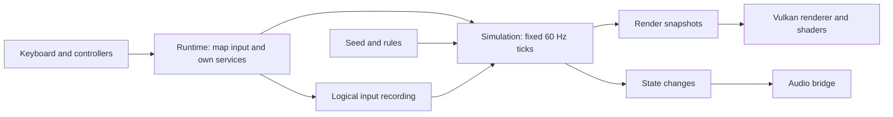

# Design guide: from deterministic simulation to a shippable game

Torus Trooper is a concrete example of a game whose simulation can run without
its window, renderer, or audio device. This guide explains the architectural
ideas, traces their implementations in this repository, and compares other
viable designs. It is for readers choosing an approach for their own games,
including games they intend to sell. It is a reference to read and revisit.

## Reader and scope

The guide assumes familiarity with functions, structs, arrays, and tests in V.
It introduces fixed-step simulation, replay, data layouts, resource ownership,
and GPU boundaries before relying on them. You can read the simulation chapters
without Vulkan or OpenCL experience. Native build requirements still apply
if you compile the complete repository, even in headless mode; see the
[technical reference](technical-reference.md#desktop-build-requirements).

The current implementation is one design point, shaped by an arcade game with
many projectiles, procedural geometry, deterministic replay, and a V/GLFW/Vulkan
runtime. A different genre, target device, art direction, or team may justify
another choice. Examples of alternatives are illustrative designs, not code
already present in this repository.

The guide uses three recurring situations to make those choices concrete:

| Situation | Dominant concern | Example consequence |
| --- | --- | --- |
| Dense arcade action | Thousands of short-lived effects and predictable frame time. | Fixed-capacity pools and compact render streams may be appropriate. |
| Asset-rich 3D game | Distinct characters, environments, animation, and art direction. | An authored asset pipeline may matter more than procedural mesh generation. |
| Broad desktop hardware support | GPU and memory budgets, driver differences, and startup cost. | Scalable effects and a checked CPU fallback may be preferable. |

These are examples, not tiers of quality. A fixed pool can ship in a commercial
game; a growable collection can also be the right production choice. The guide
explains what each choice buys and what it costs.

## System map

*Logical input* is a game action such as left or fire, independent of the key
or controller button. A *tick* is one discrete update of gameplay state. A
*render snapshot* is data extracted from that state for drawing; it does not
advance gameplay. These terms keep the same meaning throughout the guide.

The runtime may present more than one frame between two simulation ticks.
The simulation does not poll the window or play sounds. This division makes
replay, headless testing, and alternative presentation paths possible.

## Read by decision

For a quick route to a particular setting or color, use the
[code and tuning map](code-map.md).

| Chapter | Design question | Main alternatives considered |
| --- | --- | --- |
| [1. System boundaries](guide/01-system-overview.md) | Where do input, time, state, and presentation belong? | Fixed-step and variable-step hosts; immediate and retained presentation. |
| [2. Deterministic simulation and memory](guide/02-deterministic-simulation.md) | How do update order, random streams, entity storage, and cache use affect behavior and speed? | Fixed pools, growable arrays, arenas, indexed entity stores, AoS, SoA, and active lists. |
| [3. Rules and generated content](guide/03-patterns-and-progression.md) | How should difficulty, stages, courses, and barrage content be represented? | Native programs, authored data, scripts, and offline compilation. |
| [4. Replay and persistence](guide/04-replay-and-persistence.md) | What must be recorded and how long can it remain valid? | Input logs, state snapshots, hybrids, and save schemas. |
| [5. Rendering and assets](guide/05-rendering.md) | How does simulation become a frame, and where does art come from? | Procedural, purchased, commissioned, and hybrid visual assets. |
| [6. Runtime ownership and audio](guide/06-runtime-and-audio.md) | Who owns native resources and side effects? | Direct calls, adapters, events, and service lifetimes. |
| [7. Optional compute](guide/07-compute-and-verification.md) | Which work can move to a device without changing game decisions? | CPU-only, CPU/GPU split, and device-authoritative simulation. |
| [8. Configuration and evidence](guide/08-configuration-and-verification.md) | How do settings, development loops, measurements, and tests support a release? | OS-specific workflows, precedence models, performance choices, and layered validation. |
| [9. Production decisions](guide/09-production-decisions.md) | Which further decisions make this design fit a commercial product? | Art, hardware, accessibility, packaging, and support choices. |

Each chapter states the problem, explains the implementation here, then gives
multiple alternatives and the conditions that favor them. Diagrams show data
flow, order, or lifetime. Code links point to the implementation; they do not
replace the explanation.

## Evidence and limits

The [README](../README.md) introduces the game and its controls. The
[technical reference](technical-reference.md) documents builds and advanced options.
[Chapter 8](guide/08-configuration-and-verification.md) gathers reproducible
commands and explains what each check establishes. A passing test is evidence
for its specific rule; a 600-tick checksum is a regression signal for the tested
toolchain. Neither is a universal performance or cross-platform guarantee.
